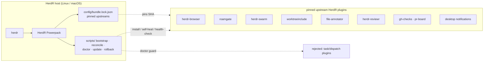
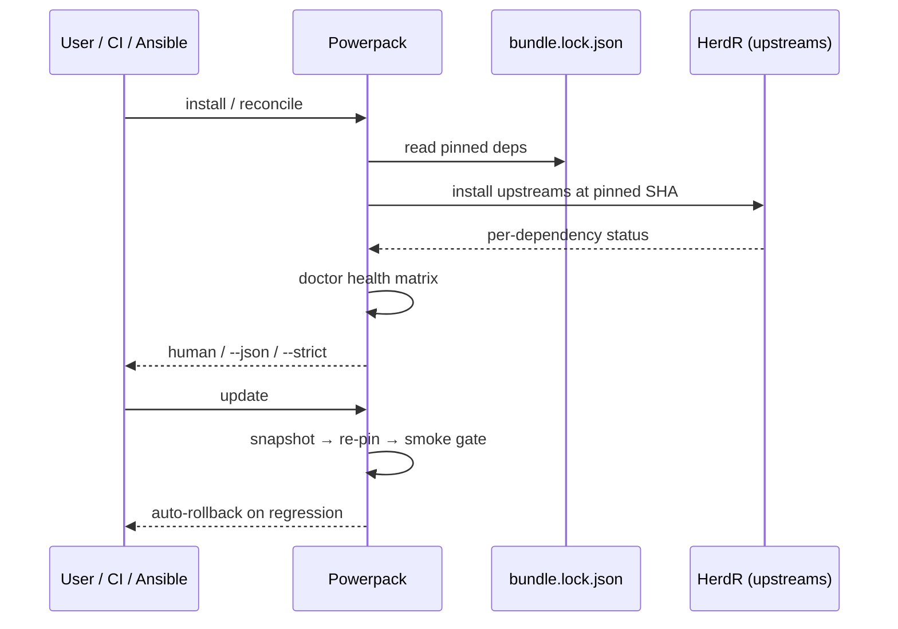
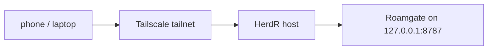

# HerdR Powerpack

> One install turns a bare HerdR into a full **agent capability bundle**: real
> Chromium browser, mobile/web client, worktree swarm fan-out, code review, GitHub/CI
> visibility, and native desktop notifications — all from a **thin meta-plugin** that
> adopts well-maintained **upstream** HerdR plugins rather than re-implementing them.

## What it is

**HerdR Powerpack** is a curated, tested distribution for HerdR (the runtime coding agents
live on). Instead of hunting down and hand-managing a dozen plugins, you install one and
get a coherent, version-locked set that composes cleanly: the browser drives QA, swarm
fans out work into per-agent worktrees, the file/diff reviewers give the agent review
feedback, gh-checks/pr-board surface CI status, roamgate gives you a private mobile/web
client, and notifications ping you natively. Every capability is pinned to an exact
commit SHA in `config/bundle.lock.json` (the lock is the source of truth — upstream
`HEAD` is never followed), degrades gracefully when a toolchain is missing, and is
guarded by a `doctor` health matrix.

The Powerpack **owns the plumbing, not the engines**: its `scripts/` provide
`bootstrap` (install), `reconcile` (self-heal), `doctor` (health), `update` (snapshot +
re-pin + smoke gate), `rollback` (restore known-good), `versions`, and a `board` pane.
Everything heavy — the browser, mobile, review, GitHub clients — is an upstream plugin.

```bash
# example: the health matrix after a clean install
$ herdr plugin action invoke berlinguyinca.powerpack.doctor
HerdR Powerpack — doctor
  herdr:       0.9.1   os: linux/x86_64   powerpack: 0.1.0
  CAPABILITY                     STATUS     HEALTH
  Browser (CDP/QA)               installed  healthy
  Swarm (worktree fan-out)       installed  healthy
  Project-local Worktrees        installed  healthy
  File Annotator (blocking diff) installed  healthy
  Desktop Notifications          installed  healthy
  reviewr (diff review)          installed  healthy
  GH Checks / PR Board           installed  degraded   (gh not authenticated)
  Roamgate (mobile)              missing    missing     (no bun — degrades gracefully)
  Plannotator                    held       held
  ✓ no competing task/dispatch state machine
  ✓ no non-loopback listeners detected
```

## Install (standalone)

```bash
curl -fsSL https://herdr.dev/install.sh | sh   # only if you don't have herdr yet
herdr plugin install berlinguyinca/herdr-powerpack
```

That's it. The build hook installs every locked upstream at its pinned SHA **best-effort**
— a missing toolchain (e.g. `bun`, `cargo`) skips a capability rather than failing the
install. Check health with `herdr plugin action invoke berlinguyinca.powerpack.doctor`.

## Deploy across many hosts (Ansible)

The bundled role is **host-agnostic** — it keys off `ansible_os_family` /
`ansible_architecture`, never host names, so the same playbook configures Linux and macOS
fleet-wide. Point it at your existing inventory, any host group:

```yaml
# inventory.yml — any group you like
[fleet]
fry        ansible_host=10.0.0.11
beast      ansible_host=10.0.0.12
bender     ansible_host=10.0.0.13
macbook-m4 ansible_host=10.0.0.20 ansible_connection=ssh
```

```bash
ansible-playbook -i inventory.yml ansible/playbook.yml
```

The role (1) installs `git`/`curl`/`jq` per OS, (2) installs herdr (official installer,
or a pinned `powerpack_herdr_url`) and the Powerpack at a pinned ref, and (3) writes the
owned `enable.list`, runs `reconcile`, then `doctor --json`. Set
`powerpack_strict_doctor: true` to fail the run on a critical finding — ideal as a
fleet-wide CI gate. Fleet defaults live in `group_vars/all.yml`; override per host in
`host_vars/`. Headless nodes are fine: GUI capabilities just report *degraded*.

```yaml
# group_vars/all.yml
powerpack_ref: <full-commit-sha>     # pin the Powerpack release for reproducible deploys
powerpack_mobile_bind: loopback      # private by default; 'tailscale' for tailnet
powerpack_prereq_bun: true           # install bun so roamgate (mobile) is available
powerpack_strict_doctor: false       # set true for a CI-style gate (not on headless)
```

## How the fabric works

The Powerpack is deliberately a **thin coordination layer**. HerdR loads it as one plugin;
its manifest exposes `bootstrap`, `reconcile`, `doctor`, `update`, `rollback`, and `board`.
At install/reconcile time it reads the lock, installs each pinned upstream, and records the
result. `doctor` cross-references what's actually installed against the lock's accepted /
`rejected` set, so it both reports health and **enforces the integration boundary** (it
flags any competing task/dispatch state machine). `update` snapshots the known-good set,
re-pins at locked SHAs, runs a smoke gate, and **auto-rolls-back on regression**;
`rollback` restores the last snapshot.





Mobile access stays **private by default**: Roamgate binds `127.0.0.1:8787`; reach it from
your phone over Tailscale rather than opening a public port.



See `docs/` for the full architecture, upstream audit, security model, and troubleshooting,
and `tests/run-tests.sh` for the 35-assertion acceptance harness (also run by CI). MIT
licensed; upstream plugins retain their own licenses (inventoried in the lock).
